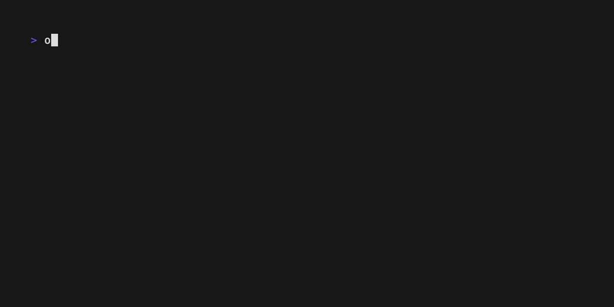

# Munin

A lightweight, elegant Terminal UI (TUI) framework for Odin, inspired by the Elm Architecture.

## Features

- **Elm Architecture Pattern**: Clean separation of Model, Update, and View
- **Cross-Platform**: Works on Linux, macOS, and Windows
- **Event-Driven Rendering**: Only redraws when state changes or window resizes
- **Window Resize Detection**: Automatically detects and responds to terminal resize events
- **Mouse Support**: Full mouse tracking including clicks, drags, and hover events
- **Screen Modes**: Fullscreen (alternative buffer) or inline rendering
- **Advanced Color Support**: Basic ANSI colors, 24-bit RGB, and 256-color palette
- **Styling**: Fluent API for styling with borders, padding, margins, and layout
- **Reusable Components**: Pre-built components for lists, tables, inputs, spinners, and more
- **Memory Safe**: Built-in allocator support with debug-time memory tracking
- **Zero Dependencies**: Uses only Odin core libraries

## Installation

Clone the repository and import it into your Odin project:

```bash
git clone https://github.com/amjadjibon/munin.git
```

## Quick Start

Here's a minimal counter example:

```odin
package main

import munin "../../munin"
import "core:fmt"
import "core:strings"

// 1. Define your Model
Model :: struct {
	counter: int,
}

init :: proc() -> Model {
	return Model{counter = 0}
}

// 2. Define your Messages
Increment :: struct {}
Decrement :: struct {}
Quit :: struct {}

Msg :: union {
	Increment,
	Decrement,
	Quit,
}

// 3. Define your Update function
update :: proc(msg: Msg, model: Model) -> (Model, bool) {
	new_model := model
	should_quit := false

	switch m in msg {
	case Increment:
		new_model.counter += 1
	case Decrement:
		new_model.counter -= 1
	case Quit:
		should_quit = true
	}

	return new_model, should_quit
}

// 4. Define your View function
view :: proc(model: Model, buf: ^strings.Builder) {
	munin.clear_screen(buf)
	munin.print_at(buf, {2, 2}, fmt.tprintf("Counter: "), .BrightGreen)
	munin.print_at(buf, {11, 2}, fmt.tprintf("%d", model.counter), .BrightRed)
	munin.print_at(buf, {2, 4}, "Press space to increment, d to decrement, q to quit", .White)
}

// 5. Define your Input handler
input_handler :: proc() -> Maybe(Msg) {
	if event, ok := munin.read_key().?; ok {
		if event.key == .Char {
			switch event.char {
			case ' ':
				return Increment{}
			case 'd':
				return Decrement{}
			case 'q', 'Q', 3:
				// q, Q, or Ctrl+C
				return Quit{}
			}
		}
	}
	return nil
}

// 6. Run your program
main :: proc() {
	program := munin.make_program(init, update, view)
	munin.run(&program, input_handler)
}
```

## Building and Running

```bash
# Build and run an example directly
cd example/counter
odin run main.odin -file

# Or build the example
odin build example/counter -out:counter
./counter

# Run tests
cd munin
odin test .
```

## Output


## Core Concepts

### The Elm Architecture

Munin follows the Elm Architecture pattern with three main components:

1. **Model**: Your application state
2. **Update**: Pure function that transforms the model based on messages
3. **View**: Pure function that renders the model to the terminal

### Program Lifecycle

```odin
// Create a program without subscriptions
program := munin.make_program(init, update, view)

// Or create a program with subscriptions (for time-based events)
program := munin.make_program(init, update, view, subscriptions)

// Run the program with optional parameters
munin.run(&program, input_handler, target_fps = 60, initial_mode = .Fullscreen, clear_on_exit = true)
```

## API Reference

> **New!** Check out the [Styling & Layout Guide](docs/STYLE.md).

### Core Functions

#### `make_program`
```odin
// Without subscriptions
make_program :: proc(
    init: proc() -> Model,
    update: proc(msg: Msg, model: Model) -> (Model, bool),
    view: proc(model: Model, buf: ^strings.Builder),
    allocator := context.allocator,
) -> Program(Model, Msg)

// With subscriptions
make_program :: proc(
    init: proc() -> Model,
    update: proc(msg: Msg, model: Model) -> (Model, bool),
    view: proc(model: Model, buf: ^strings.Builder),
    subscriptions: proc(Model) -> Maybe(Msg),
    allocator := context.allocator,
) -> Program(Model, Msg)
```

#### `run`
```odin
run :: proc(
    program: ^Program(Model, Msg),
    input_handler: proc() -> Maybe(Msg),
    target_fps: i64 = 60,
    initial_mode: Screen_Mode = .Fullscreen,  // .Fullscreen or .Inline
    clear_on_exit: bool = true,
)
```

### Rendering Functions

#### Screen Control
```odin
clear_screen :: proc(buf: ^strings.Builder)
move_cursor :: proc(buf: ^strings.Builder, pos: Vec2i)
hide_cursor :: proc(buf: ^strings.Builder)
show_cursor :: proc(buf: ^strings.Builder)
```

#### Drawing
```odin
// Draw a box at position with width and height
draw_box :: proc(buf: ^strings.Builder, pos: Vec2i, width, height: int, color: Color = .Reset)

// Print text at position
print_at :: proc(buf: ^strings.Builder, pos: Vec2i, text: string, color: Color = .Reset)

// Print formatted text at position
printf_at :: proc(buf: ^strings.Builder, pos: Vec2i, color: Color, format: string, args: ..any)

// Draw centered title
draw_title :: proc(
    buf: ^strings.Builder,
    pos: Vec2i,
    width: int,
    title: string,
    color: Color = .Reset,
    bold := false,
)
```

#### Text Styling
```odin
set_color :: proc(buf: ^strings.Builder, color: Color)
set_bg_color :: proc(buf: ^strings.Builder, color: Color)
set_bold :: proc(buf: ^strings.Builder)
set_dim :: proc(buf: ^strings.Builder)
set_underline :: proc(buf: ^strings.Builder)
set_blink :: proc(buf: ^strings.Builder)
set_reverse :: proc(buf: ^strings.Builder)
reset_style :: proc(buf: ^strings.Builder)
```

### Window Functions

```odin
// Get current terminal size
get_window_size :: proc() -> (width, height: int, ok: bool)

// Set terminal window title
set_window_title :: proc(buf: ^strings.Builder, title: string)
```

### Input Functions

```odin
// Read keyboard input (non-blocking)
read_key :: proc() -> Maybe(Key_Event)
```

### Types

#### `Vec2i`
2D integer vector for positions:
```odin
Vec2i :: [2]int

// Usage
pos := Vec2i{x, y}
munin.print_at(buf, {10, 5}, "Hello", .Green)
```

#### `Color`
Color is a union type supporting multiple color formats:
```odin
// Basic ANSI colors (16 colors)
Basic_Color :: enum {
    Reset,
    Black, Red, Green, Yellow, Blue, Magenta, Cyan, White,
    BrightBlack, BrightRed, BrightGreen, BrightYellow,
    BrightBlue, BrightMagenta, BrightCyan, BrightWhite,
    Gray,  // Alias for BrightBlack
}

// 24-bit RGB color
RGB :: struct { r, g, b: u8 }

// 256-color palette (0-255)
ANSI256 :: distinct u8

// Union type
Color :: union { Basic_Color, RGB, ANSI256 }

// Usage examples
munin.print_at(buf, {0, 0}, "Basic color", .Red)
munin.print_at(buf, {0, 1}, "RGB color", RGB{255, 0, 128})
munin.print_at(buf, {0, 2}, "256 color", ANSI256(208))
```

#### `Key_Event`
```odin
Key_Event :: struct {
    key:   Key,
    char:  rune,
    shift: bool,
    ctrl:  bool,
    alt:   bool,
}

Key :: enum {
    Unknown,
    Char,
    Up,
    Down,
    Left,
    Right,
    Enter,
    Escape,
    Backspace,
    Tab,
    PageUp,
    PageDown,
}
```

#### `Mouse_Event`
```odin
Mouse_Event :: struct {
    button: Mouse_Button,
    type:   Mouse_Event_Type,
    x:      int,
    y:      int,
    shift:  bool,
    ctrl:   bool,
    alt:    bool,
}

Mouse_Button :: enum {
    None,
    Left,
    Right,
    Middle,
    WheelUp,
    WheelDown,
}

Mouse_Event_Type :: enum {
    Press,
    Release,
    Drag,
    Move,
}
```

## Memory Management

Munin supports custom allocators and memory tracking:

```odin
main :: proc() {
    // Debug-time memory tracking
    when ODIN_DEBUG {
        track: mem.Tracking_Allocator
        mem.tracking_allocator_init(&track, context.allocator)
        context.allocator = mem.tracking_allocator(&track)

        defer {
            if len(track.allocation_map) > 0 {
                fmt.eprintf("=== %v allocations not freed: ===\n", len(track.allocation_map))
                for _, entry in track.allocation_map {
                    fmt.eprintf("- %v bytes @ %v\n", entry.size, entry.location)
                }
            }
            mem.tracking_allocator_destroy(&track)
        }
    }

    // Create program with custom allocator
    program := munin.make_program(init, update, view, allocator = context.allocator)
    munin.run(&program, input_handler)
}
```

## Advanced Features

### Subscriptions

Subscriptions allow you to handle time-based or external events:

```odin
subscriptions :: proc(model: Model) -> Maybe(Msg) {
    // Check for tick every frame
    if model.should_tick {
        return Tick{}
    }
    return nil
}

main :: proc() {
    program := munin.make_program(init, update, view, subscriptions)
    munin.run(&program, input_handler)
}
```

### Window Resize Handling

Munin automatically detects window resizes. Get the current size in your view:

```odin
view :: proc(model: Model, buf: ^strings.Builder) {
    munin.clear_screen(buf)

    width, height, ok := munin.get_window_size()
    if !ok {
        width = 80
        height = 24
    }

    // Center content based on terminal size
    center_x := width / 2
    center_y := height / 2

    munin.print_at(buf, {center_x - 5, center_y}, "Centered!", .Green)
}
```

### Custom Frame Rate

Control the rendering frame rate:

```odin
main :: proc() {
    program := munin.make_program(init, update, view)
    munin.run(&program, input_handler, target_fps = 30)  // 30 FPS
}
```

### Screen Modes

Munin supports two rendering modes:

```odin
// Fullscreen mode (alternative screen buffer - default)
munin.run(&program, input_handler, initial_mode = .Fullscreen)

// Inline mode (renders in-place like a regular CLI app)
munin.run(&program, input_handler, initial_mode = .Inline)

// Toggle modes at runtime
munin.toggle_screen_mode(&program)
munin.set_screen_mode(&program, .Inline)
```

### Mouse Input

Mouse tracking is automatically enabled. Handle mouse events in your input handler:

```odin
input_handler :: proc() -> Maybe(Msg) {
    if event, ok := munin.read_input().?; ok {
        switch e in event {
        case munin.Key_Event:
            // Handle keyboard
        case munin.Mouse_Event:
            if e.button == .Left && e.type == .Press {
                return Click{x = e.x, y = e.y}
            }
        }
    }
    return nil
}
```

### Styling System

Munin includes a powerful styling system:

```odin
import munin "path/to/munin"

// Create a styled box
style := munin.new_style()
style = munin.style_foreground(style, .BrightCyan)
style = munin.style_background_str(style, "#1e1e1e")
style = munin.style_bold(style)
style = munin.style_padding_all(style, 1)
style = munin.style_border(style, munin.Border_Rounded)
style = munin.style_border_foreground(style, .BrightMagenta)
style = munin.style_width(style, 40)

output := munin.style_render(style, "Hello, Munin!")
defer delete(output)  // Important: must delete returned string

fmt.println(output)
```

#### Layout Composition

Compose multiple styled blocks:

```odin
// Horizontal layout
left := munin.style_render(style_left, "Left Panel")
defer delete(left)
right := munin.style_render(style_right, "Right Panel")
defer delete(right)

joined := munin.join_horizontal(.Center, {left, right}, gap = 2)
defer delete(joined)

// Vertical layout
top := munin.style_render(style_top, "Header")
defer delete(top)
bottom := munin.style_render(style_bottom, "Footer")
defer delete(bottom)

stacked := munin.join_vertical(.Left, {top, bottom}, gap = 1)
defer delete(stacked)
```

See [docs/STYLE.md](docs/STYLE.md) for complete styling documentation.

## Components

Munin provides a set of reusable UI components in the `components` package:

- **Box**: Customizable boxes with borders
- **Input**: Text input fields
- **List**: Lists with multiple styles (bullet, numbered, checkboxes)
- **Pagination**: Page navigation component
- **Progress**: Progress bars
- **Spinner**: Loading spinners with various styles
- **Table**: Data tables with headers and rows
- **Text**: Text rendering with word wrap
- **Timer**: Countdown and stopwatch timers

See the `example/` directory and `docs/` for component documentation.

## Examples

The `example/` directory contains numerous examples demonstrating various features:

- **counter**: Basic counter app (canonical example)
- **fstree**: Full file system tree viewer (like `tree` command)
- **tree**: Tree component demo with sample data
- **style**: Lipgloss-inspired styling system
- **mouse**: Mouse input and click handling
- **hover**: Hover effects and tracking
- **lists**: Various list styles and scrolling
- **tables**: Data table rendering
- **forms**: Input forms with validation
- **spinners**: Loading animations
- **progress**: Progress bar implementations
- **timer**: Countdown and elapsed time
- **pagination**: Multi-page navigation
- **inline**: Inline rendering mode
- **boxes**: Border and box styles
- **colors**: Color palette showcase

Each example demonstrates:
- Responsive layout that adapts to terminal size
- Colored rendering and styling
- Input handling (keyboard and/or mouse)
- Memory safety with tracking allocators

## Performance Tips

1. **Event-Driven Rendering**: Munin only redraws when state changes, window resizes, or subscriptions fire. This minimizes CPU usage and rendering overhead.

2. **String Builder Efficiency**: The framework uses a pre-allocated string builder (4KB default) to minimize allocations during rendering.

3. **Frame Rate Control**: Set an appropriate `target_fps` based on your needs. 60 FPS is the default, but 30 FPS is often sufficient for most TUI apps.

4. **Minimize View Complexity**: Keep your view function efficient since it's called every frame when redrawing.

5. **Memory Management**: Style render functions (`style_render`, `join_horizontal`, `join_vertical`) return heap-allocated strings. Always `delete()` them after use to prevent memory leaks.

6. **Use Temp Allocator**: For temporary allocations within the view function, use `context.temp_allocator` which is automatically cleared at the end of each frame.

## Testing

Run the test suite:

```bash
cd munin
odin test .
```

The tests cover:
- ANSI escape sequence stripping
- Line counting with Unicode and wide characters
- Terminal mode setup and teardown
- Input parsing for keyboard and mouse events
- Rendering utility functions

## Platform Support

- **Linux**: Full support (POSIX termios for raw mode)
- **macOS**: Full support (POSIX termios for raw mode)
- **Windows**: Partial support (Win32 console APIs with virtual terminal processing)

**Note**: Windows support is implemented in the codebase but may have limitations. Testing on Windows is recommended.

## License

This project is open source. See LICENSE file for details.

## Contributing

Contributions are welcome! Please feel free to submit issues and pull requests.

## Documentation

- [Styling & Layout Guide](docs/STYLE.md) - Comprehensive guide to the styling system
- [Component Docs](docs/) - Individual component documentation
- [Examples](example/) - Complete working examples

## Acknowledgments

Inspired by:
- The Elm Architecture
- Bubble Tea (Go TUI framework)
- Lipgloss (Go styling library)
- Termbox and other terminal libraries
